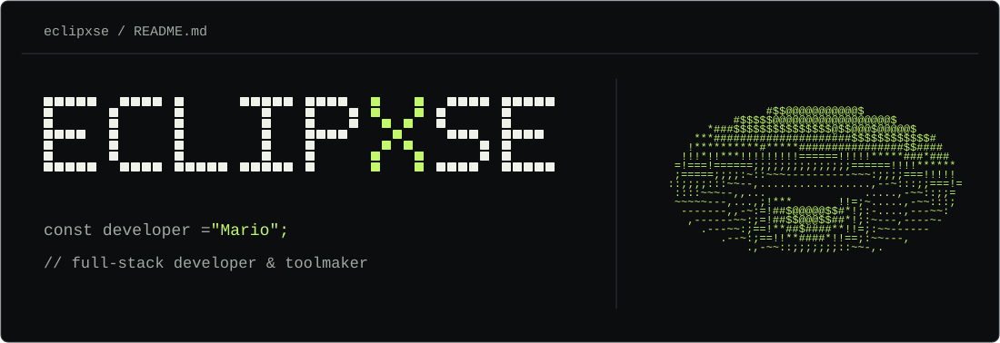
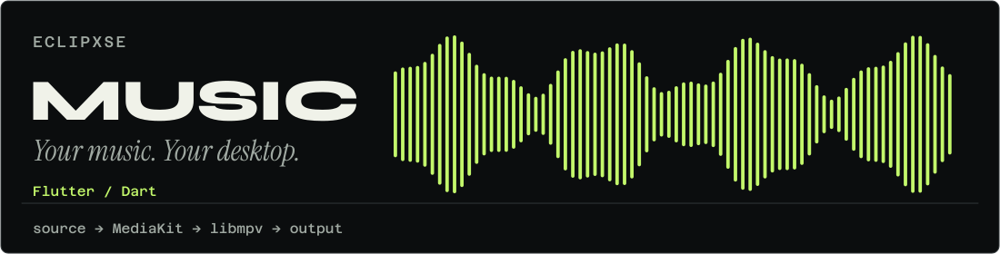
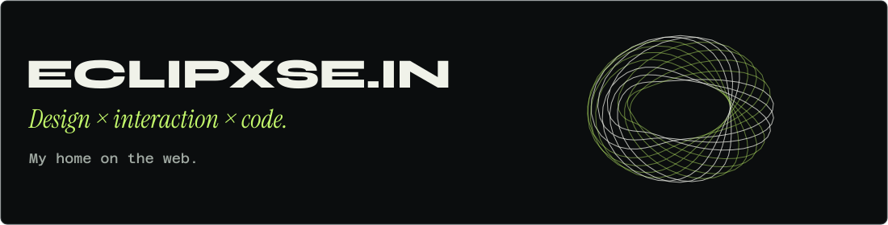
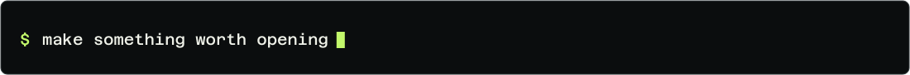

<picture>
  <source media="(max-width: 600px)" srcset="./assets/readme/code/boot-mobile-still.svg">
  
</picture>

**I'm Mario.** I build desktop tools and web experiences, with a thing for interfaces that have a personality.

[Music ↓](#user-content-eclipxse-music) &nbsp;·&nbsp; [Portfolio ↓](#user-content-eclipxsein) &nbsp;·&nbsp; [Contact](mailto:lawliet@eclipxse.in)

---

<h2 id="eclipxse-music">Eclipxse Music</h2>

<a href="https://github.com/Eclipxse/Eclipxse_music_exe">
<picture>
  <source media="(max-width: 600px)" srcset="./assets/readme/code/music-mobile-still.svg">
  
</picture>
</a>

A personal Windows build of [Musify](https://github.com/gokadzev/Musify), tuned for desktop listening. Local audio, a compact player, native media controls, and an eight-band equalizer.

**[Download for Windows ↗](https://github.com/Eclipxse/Eclipxse_music_exe/releases/latest)** &nbsp;·&nbsp; [Repository](https://github.com/Eclipxse/Eclipxse_music_exe)

<code>inspect music</code>: stack &amp; controls

`Flutter` · `Dart` · `MediaKit` · `libmpv`

| Shortcut | Action |
| :--- | :--- |
| `Ctrl + O` | Open local audio |
| `Ctrl + Shift + M` | Toggle compact player |
| `Ctrl + Space` | Play / pause |

Customized from the open-source Musify project. Corresponding source archives are included with the [Windows releases](https://github.com/Eclipxse/Eclipxse_music_exe/releases).

 

<h2 id="eclipxsein">Eclipxse.in</h2>

<a href="https://eclipxse.in/">
<picture>
  <source media="(max-width: 600px)" srcset="./assets/readme/code/portfolio-mobile-still.svg">
  
</picture>
</a>

My corner of the web: selected work, sculptural scroll sequences, deliberate typography, and the details that make a website feel personal.

**[Open the portfolio ↗](https://eclipxse.in/)** &nbsp;·&nbsp; [Source](https://github.com/Eclipxse/Eclipxse)

<code>inspect portfolio</code>: under the hood

`JavaScript` · `GSAP` · `Lenis` · `HTML / CSS`

A custom static site with scroll-driven animation, project previews, and dedicated work pages.

---

**Something interesting to build?** [Email me](mailto:lawliet@eclipxse.in) or find me on [LinkedIn](https://www.linkedin.com/in/eclipxse/).

<picture>
  <source media="(max-width: 600px)" srcset="./assets/readme/code/signoff-mobile-still.svg">
  
</picture>

[Profile code](./scripts/build-profile.mjs) &nbsp;·&nbsp; [Animated edition](./README.md)
