  <picture>
    
  </picture>

  <strong>I make software I want to keep open.</strong> 
  Desktop audio, considered interfaces, and a personal corner of the web.

  <a href="#eclipxse-music">Music</a> &nbsp; / &nbsp;
  <a href="#eclipxsein">Portfolio</a> &nbsp; / &nbsp;
  <a href="mailto:lawliet@eclipxse.in">Say hello</a>
    
  <a href="./README.md">View the animated version</a>

 

<h2 id="eclipxse-music">Eclipxse Music</h2>

01 &nbsp; / &nbsp; DESKTOP AUDIO &nbsp; / &nbsp; WINDOWS

<a href="https://github.com/Eclipxse/Eclipxse_music_exe">
  <picture>
    
  </picture>
</a>

A personal Windows build of <a href="https://github.com/gokadzev/Musify">Musify</a>, shaped around a focused desktop listening experience. Local audio, a compact player, native media controls, and an eight-band equalizer.

<code>Flutter</code> &nbsp; <code>Dart</code> &nbsp; <code>MediaKit</code> &nbsp; <code>libmpv</code>

<a href="https://github.com/Eclipxse/Eclipxse_music_exe/releases/latest"><strong>Download for Windows ↗</strong></a> &nbsp; / &nbsp; <a href="https://github.com/Eclipxse/Eclipxse_music_exe">Explore the project</a>

 

<h2 id="eclipxsein">Eclipxse.in</h2>

02 &nbsp; / &nbsp; PERSONAL PORTFOLIO &nbsp; / &nbsp; WEB

<a href="https://eclipxse.in/">
  <picture>
    
  </picture>
</a>

My home on the web. Selected work, sculptural scroll sequences, deliberate typography, and the details that make an interface feel personal.

<code>JavaScript</code> &nbsp; <code>GSAP</code> &nbsp; <code>Lenis</code> &nbsp; <code>HTML / CSS</code>

<a href="https://eclipxse.in/"><strong>Enter the portfolio ↗</strong></a> &nbsp; / &nbsp; <a href="https://github.com/Eclipxse/Eclipxse">View source</a>

 

  <strong>Have something interesting in mind?</strong>  
  <a href="mailto:lawliet@eclipxse.in">Email</a> &nbsp; / &nbsp;
  <a href="https://www.linkedin.com/in/eclipxse/">LinkedIn</a>

  <picture>
    
  </picture>

<!-- After Hours: original self-contained SVG motion; reduced-motion support and a static edition. -->
