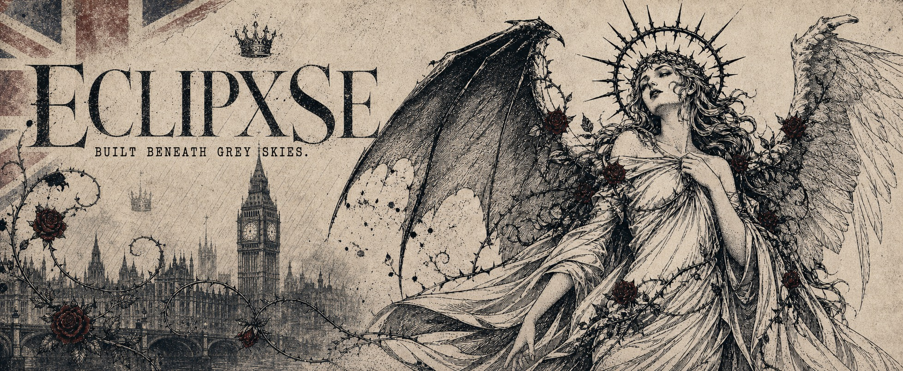
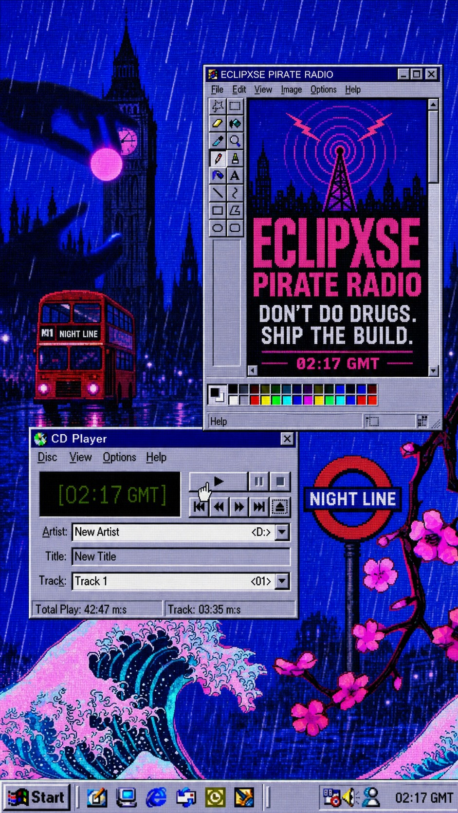
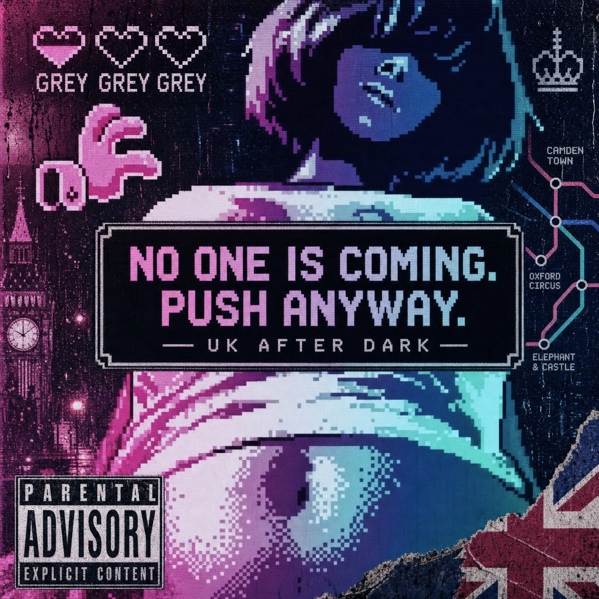
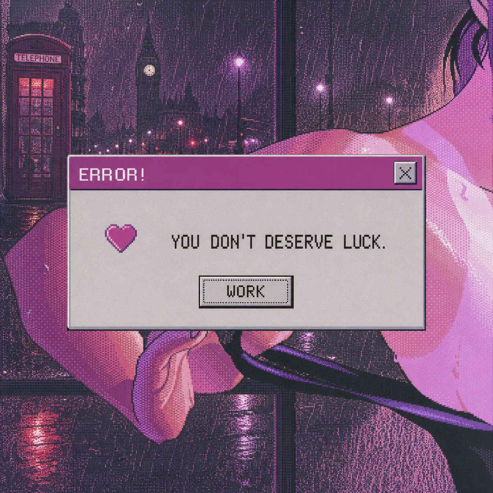

  

  TRANSMISSION 019 &nbsp;//&nbsp; LONDON AFTER DARK &nbsp;//&nbsp; SIGNAL UNSTABLE
    
  <strong>MARIO.CPP / ECLIPXSE</strong>
   
  <em>building strange little machines beneath grey skies.</em>

  <a href="https://github.com/Eclipxse/Eclipxse_music_exe">music</a>
  &nbsp;&nbsp;×&nbsp;&nbsp;
  <a href="https://github.com/Eclipxse/browser">browser</a>
  &nbsp;&nbsp;×&nbsp;&nbsp;
  <a href="https://github.com/Eclipxse/Streak_forge">tools</a>
  &nbsp;&nbsp;×&nbsp;&nbsp;
  <a href="https://github.com/Eclipxse?tab=repositories">archive</a>

 

  <code>MIND THE GAP BETWEEN THE IDEA AND THE BUILD.</code>

 

<table>
  <tr>
    <td width="46%" valign="top">
      
    </td>
    <td width="54%" valign="top">
      
NOW TRANSMITTING

      

        <a href="https://github.com/Eclipxse/Eclipxse_music_exe"><strong>01 / ECLIPXSE MUSIC</strong></a> 
        A focused Windows music client built with Flutter, MediaKit and libmpv.
      

      

        <a href="https://github.com/Eclipxse/browser"><strong>02 / ECLIPXSE BROWSER</strong></a> 
        An Electron, React and TypeScript browser prototype with quiet chrome and sharp edges.
      

      

        <a href="https://github.com/Eclipxse/Streak_forge"><strong>03 / STREAK FORGE</strong></a> 
        A gothic-seraph coding cockpit for keeping the daily ritual alive.
      

      

        <a href="https://github.com/Eclipxse/attendance_analyser"><strong>04 / ATTENDANCE ANALYSER</strong></a> 
        A local-first face-recognition attendance system for the browser.
      

       
      <blockquote>
        THE LAST TRAIN DOESN'T WAIT FOR POTENTIAL.
      </blockquote>
      

        Currently interested in desktop software, strange interfaces, music systems, browsers, automation and tools that feel like they came from the wrong timeline.
      

    </td>
  </tr>
</table>

 

  

 

<table>
  <tr>
    <td width="50%" valign="top">
      OPERATING SYSTEM / 01  
      <strong>INTERFACES</strong> 
      <code>Flutter</code> · <code>React</code> · <code>Nuxt</code> · <code>Electron</code>
    </td>
    <td width="50%" valign="top">
      OPERATING SYSTEM / 02  
      <strong>MACHINERY</strong> 
      <code>Dart</code> · <code>TypeScript</code> · <code>JavaScript</code> · <code>Node.js</code>
    </td>
  </tr>
  <tr>
    <td width="50%" valign="top">
      WEATHER REPORT  
      <strong>PERMANENTLY OVERCAST</strong> 
      Good conditions for shipping software nobody asked for.
    </td>
    <td width="50%" valign="top">
      HOUSE RULE  
      <strong>DON'T WAIT FOR LUCK</strong> 
      Make the thing. Break the thing. Make it stranger.
    </td>
  </tr>
</table>

 

  <strong>GOOD IDEAS MISS THE LAST TRAIN.</strong> 
  bad ideas stay out until morning.

 

  

  
    
  END OF TRANSMISSION &nbsp;//&nbsp; CARRY ON

<!-- UK AFTER DARK profile system created for Eclipxse. -->
