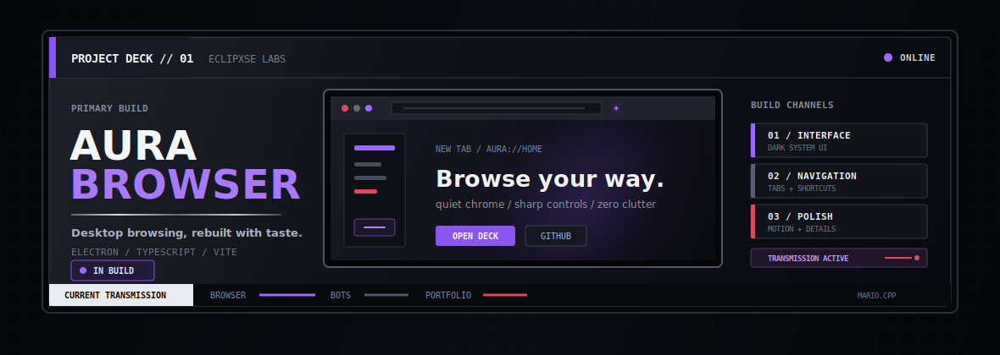
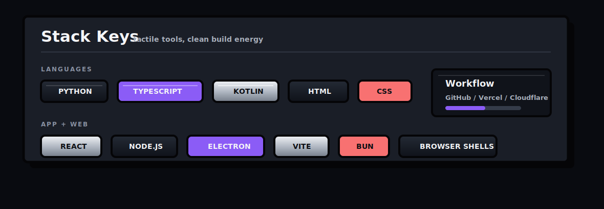
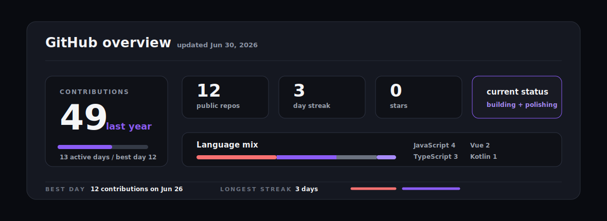

# 💫 About Me:
🧃 Building random-but-useful stuff: browsers, bots, tools, and clean web interfaces 
🔭 Currently cooking **Aura Browser** and making my portfolio feel less NPC 
🤝 Down to collab on Discord bots, web apps, dev tools, or any weird idea with aura 
🌱 Learning TypeScript, Electron, backend systems, and how to make UI actually hit 
💬 Ask me about bot ideas, browser experiments, portfolio sites, or shipping projects fast 
⚡ Fun fact: most of my best repos start as “wait what if I made this real”

 

 

 

---

  

<!-- Custom profile system: Afterdark hardware / Eclipxse. -->
