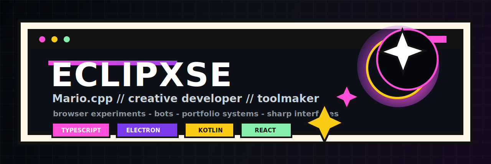
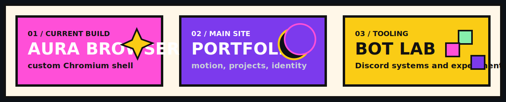
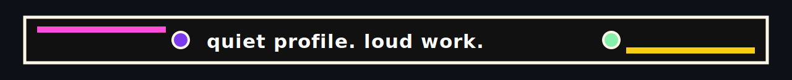

<div align="center">
  
</div>

<p align="center">
  <a href="https://eclipxse.in"></a>
  <a href="https://guns.lol/mario.cpp"></a>
  <a href="https://github.com/Eclipxse/browser"></a>
</p>

<p align="center">
  <strong>Creative developer and toolmaker building browser experiments, bots, portfolio systems, and sharp web interfaces.</strong>
</p>

<br />



## Current Signal

```txt
alias     : Mario.cpp / Eclipxse
focus     : TypeScript tools, browser shells, bots, portfolio systems
style     : dark interfaces, precise motion, clean visual identity
shipping  : Aura Browser, Brownizzz, Eclipxse portfolio, web experiments
```

## Featured Work

| Project | Signal | Stack |
| --- | --- | --- |
| [Aura Browser](https://github.com/Eclipxse/browser) | A cute neo-brutalist Chromium browser prototype with tabs, bookmarks, notes, command palette, and split workspace. | TypeScript, React, Electron |
| [Eclipxse Portfolio](https://github.com/Eclipxse/Eclipxse) | Motion-led personal site with custom project pages, brand assets, and a full portfolio system. | JavaScript, CSS, HTML |
| [Brownizzz](https://github.com/Eclipxse/Brownizzz) | Open-source Discord bot work and TypeScript bot infrastructure. | TypeScript, Node.js |
| [Vaidik_site](https://github.com/Eclipxse/Vaidik_site) | Vue site work with polished front-end structure. | Vue, JavaScript |

## Toolbelt

<p>
  
</p>

## GitHub Signal

<p align="center">
  
  
</p>

<p align="center">
  
</p>

## Build Philosophy

- Make useful tools that still have a visual identity.
- Keep interfaces sharp, readable, and fast.
- Learn in public by shipping small but real projects.
- Treat the profile like a launch screen, not a business card.

<br />

<div align="center">
  
</div>
